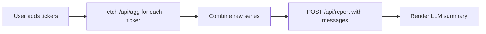

Here’s a polished, drop-in **README.md** you can paste into your repo.
It documents the app, the local setup, endpoints, and the OpenAI/prompt-engineering topics from your slide.

---

# Stocktopus — AI-assisted Stock Summary (Vite + Express)

Eight arms, zero clue… somehow right. 🐙
Stocktopus fetches recent OHLC data for one or more tickers and asks an LLM to write a concise, human-readable report (buy/hold/sell).
It’s built as a secure **Vite (frontend)** + **Express (backend)** app so API keys stay private.

---

## ✨ Features

* Add one or more stock tickers (e.g., `AAPL`, `TSLA`) and auto-fetch recent aggregates.
* Server-side proxy to **Polygon.io** (keeps your key off the client).
* Server-side call to **OpenAI** to generate a short report in a specific tone.
* Clean dev experience with Vite HMR and an API proxy (`/api/*` → `http://localhost:3001`).
* Teaches core **OpenAI API** and **Prompt Engineering** concepts (see “Learning Notes”).

---

## 🧱 Tech Stack

* Frontend: **Vite**, vanilla JS, HTML/CSS
* Backend: **Express**, Node 18+
* APIs: **Polygon.io**, **OpenAI**
* Env: `.env` (server-side only)

---

## 📦 Project Structure

```
project-root/
├─ index.html
├─ index.css
├─ index.js                 # frontend entry (no API keys here)
├─ utils/
│  └─ dates.js             # start/end date helpers
├─ server.js                # Express backend: /api/agg + /api/report
├─ vite.config.js           # dev server proxy to Express
├─ package.json
├─ .env                     # POLYGON_API_KEY & OPENAI_API_KEY (gitignored)
└─ .gitignore               # node_modules, dist, .env, etc.
```

---

## 🔐 Environment Variables

Create a `.env` file in the project root:

```
POLYGON_API_KEY=your_polygon_key_here
OPENAI_API_KEY=your_openai_key_here
```

> **Important:** `.env` is **gitignored**. Do not commit secrets.

---

## 🚀 Local Development

1. **Install dependencies**

```bash
npm install
```

2. **Run the backend (Express)**

```bash
npm run api
# Starts on http://localhost:3001
```

3. **Run the frontend (Vite)**

```bash
npm run dev
# Opens http://localhost:5173
```

4. **Use the app**

* Enter one or more tickers, click **Generate Report**.
* The UI fetches:

  * `GET /api/agg/:ticker?start=YYYY-MM-DD&end=YYYY-MM-DD`
  * `POST /api/report` with a messages array for the LLM

---

## 🔌 API Endpoints (Dev)

### `GET /api/agg/:ticker`

Fetch Polygon aggregates (proxied by server).

**Query**

* `start` — `YYYY-MM-DD`
* `end` — `YYYY-MM-DD`

**Example**

```
/api/agg/AAPL?start=2024-10-01&end=2024-10-07
```

**Why proxy?**
Prevents exposing your Polygon key in the browser.

---

### `POST /api/report`

Generate a short stock report via OpenAI.

**Body**

```json
{
  "messages": [
    {"role": "system", "content": "instructions..."},
    {"role": "user", "content": "parsed OHLC data and style examples..."}
  ]
}
```

**Response**

```json
{
  "role": "assistant",
  "content": "Final report text..."
}
```

---

## 🧭 Frontend Flow (simplified)



---

## 🔒 Why keys never live in the browser

* **Frontend → Backend** only (no direct OpenAI/Polygon calls from client).
* **Express** reads `.env` and talks to external APIs.
* Safer by default; works for both dev and production.

---

## 🛠 Scripts

```json
{
  "scripts": {
    "dev": "vite",
    "api": "node server.js",
    "build": "vite build",
    "preview": "vite preview"
  }
}
```

> Tip: If you prefer one terminal, you can add `concurrently` later to run both.

---

## 🧪 Quick Smoke Tests

* Polygon proxy works:

  ```
  http://localhost:3001/api/agg/AAPL?start=2024-10-01&end=2024-10-07
  ```

  If you see `Unknown API Key`, fix `POLYGON_API_KEY` and restart `npm run api`.

* OpenAI works (temporary debug route suggestion):

  ```js
  // server.js (dev only)
  // app.get('/api/ping-openai', async (_, res) => {
  //   const r = await openai.chat.completions.create({
  //     model: 'gpt-4o-mini',
  //     messages: [{ role: 'user', content: 'Say "pong".' }]
  //   });
  //   res.send(r.choices[0].message.content);
  // });
  ```

  Then hit `http://localhost:3001/api/ping-openai`.

---

## 📚 Learning Notes — OpenAI API Essentials (from the slide)

### 1) How to use the OpenAI API

* **Dependency**

  ```bash
  npm install openai
  ```

  ```js
  import OpenAI from 'openai';
  const openai = new OpenAI({ apiKey: process.env.OPENAI_API_KEY });
  ```

* **Requests / Models**
  Chat:

  ```js
  const res = await openai.chat.completions.create({
    model: 'gpt-4o-mini',  // choose an available model
    messages
  });
  ```

* **Messages array**
  Chat uses `[{ role, content }]` in order:

  * `system` — set behavior/tone/policy (“You are a trading guru…”)
  * `user` — actual prompt, data, and examples
  * `assistant` — prior responses (for continuity), optional

* **Tokens**

  * Controls input+output length and cost.
  * `max_tokens` caps output length:

    ```js
    max_tokens: 250
    ```

### 2) Prompt Engineering

* **How to instruct the model**
  Be explicit: objective, length limit, audience, tone.

* **Temperature**
  Higher → more diverse/creative; lower → focused/deterministic.

  ```js
  temperature: 0.2  // analytic
  // or 1.0+ for spicy takes
  ```

* **Few-shot approach**
  Provide 1–3 small examples in the `user` (or as separate turns) to anchor style/format.

* **Stop sequence**
  Use `stop: ["###"]` to prevent the model from continuing past a delimiter.

* **Presence & Frequency Penalties**

  * *Presence* encourages new topics, reduces repetition of seen tokens at all.
  * *Frequency* penalizes tokens repeated too often.

  ```js
  presence_penalty: 0.0,
  frequency_penalty: 0.2
  ```

* **Prototyping with the Playground**
  Use OpenAI’s Playground to iterate on prompts, then port the winning config back to code (model, temperature, max tokens, stop, etc.).


---

## 🗺️ Roadmap / Ideas

* Add ticker removal & validation UI.
* Persist recent tickers in `localStorage`.
* Chart the OHLC series with a tiny chart lib.
* Add model/temperature controls in the UI.
* Server-side caching of Polygon responses.

---

## 📝 License

MIT — do what you like, but no warranty.

---

## 🙌 Credits

Built with ❤️ using Vite + Express.
Data by [Polygon.io]. LLM magic by OpenAI.
